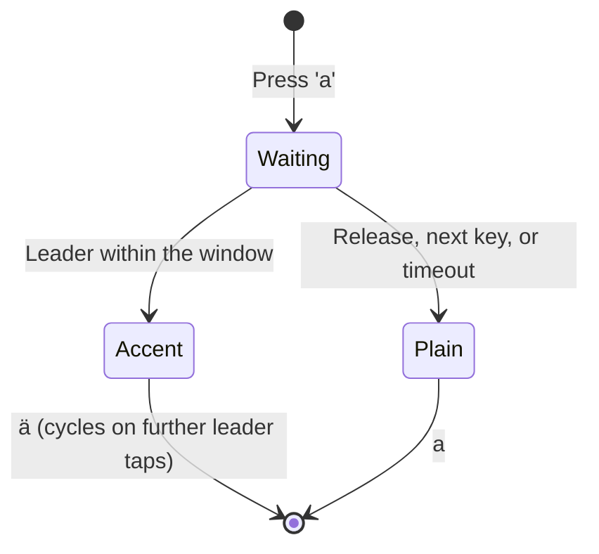

<!--
SPDX-FileCopyrightText: 2026 Maik-0000FF
SPDX-License-Identifier: GPL-3.0-or-later
-->

# How It Works

## Compared to other accent input methods

| Method | Rhythm break? | Mode switch? | Layout switch? | Learning curve |
|---|---|---|---|---|
| Compose key | Yes (syntax `" a`) | Yes | No | Medium |
| Dead keys | Yes (dedicated key) | Yes | No | Small |
| AltGr layouts (Neo, US-Intl) | No | No | **Yes** (entire layout) | High |
| Mobile long-press (Android/iOS) | Yes (popup wait) | Yes | N/A | Small |
| **Schnelle Zeichen** | **No** | **No** | **No** | Small |

There is no wait and no popup to aim at: you press the mapped key and the
leader in the natural rhythm of touch typing. The keypresses may overlap,
exactly as adjacent letters already do when typing fast. The gesture gives
that existing overlap a meaning instead of asking for a new motor skill.

## The gesture

The leader is <kbd>Space</kbd> by default; arrows, Alt, AltGr and custom
physical keys are available too.

## Why mapped keys feel slightly different

An unmapped key appears on **press**, instantly. A mapped key is held back
until the engine knows what you mean:

| What happens next | Result |
|---|---|
| Leader arrives inside the window | the accent (first variant) |
| Same key released | the plain character |
| Any other key pressed | the plain character instantly, next key passes through |
| Window times out | the plain character |

The third row is why fast typists rarely notice anything: as long as you keep
typing, mapped letters resolve immediately on the next keypress. Typing "as"
quickly is just `as`; only deliberately holding <kbd>a</kbd> and tapping the
leader gives `ä`.

## Cycling

With multiple variants (`e=é,è,ê,ë`), each leader tap steps to the next one;
a reverse leader steps backward and starts at the **last** variant. Nothing
is committed until you release the held key, and the optional overlay mirrors
the current selection on screen. Forward and reverse leaders share one
position, so you can overshoot by one and step back.

## The time window

Each gesture has a window `[min, max]` in milliseconds (defaults: 0-400 ms
lowercase, 0-700 ms uppercase). The leader triggers only inside the window.
A minimum of 0 means the leader can arrive as early as it likes, so the
accent works at full typing speed. Raising the minimum adds a deliberate
hold before the accent arms; the optional unlimited mode removes the upper
bound and keeps the window open for as long as the key is held. Combined
with the overlay's trigger preview this gives the hold-and-pick popup feel;
see [Configuration → Recipe: popup feel](CONFIGURATION.md#recipe-popup-feel-quick-accent-style).
